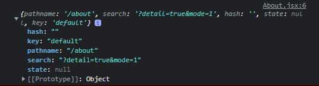

# react-router v6

##### 참고 https://velog.io/@velopert/react-router-v6-tutorial

## 라이브러리 설치

### yarn : `yarn add react-router-dom`

### npm : `npm i react-router-dom`

## 라우터 적용 방법

### 먼저 라우터를 적용할때는 index.js 파일에서 react-router-dom를 임포트 한후 내장되어 있는 BrowserRouter를 사용하여 감싸줘야 한다

```js
import { BrowserRouter } from "react-router-dom";

ReactDOM.render(
  <BrowserRouter>
    <App />
  </BrowserRouter>,
  document.getElementById("root")
);
```

### 이런식으로 감싸준다

## Route 컴포넌트로 특정 경로에 원하는 컴포넌트 보여주기

### Route 컴포넌트 사용방법 : `<Router path="주소규칙" element={보여줄 컴포넌트}/>`

### 이 Route 컴포넌트는

```js
const App = () => {
  return (
    <Routes>
      <Route path="/" element={<Home />} />
      <Route path="/about" element={<About />} />
    </Routes>
  );
};
```

### 이렇게 Routes 컴포넌트 안에 포함되어야 한다+

## Link 컴포넌트를 사용하여 다른 페이지로 이동하기

### Link 컴포넌튼느 페이지를 새로 불러오는 것을 막고 History API를 통해 브라우저 주소의 경로만 바꾸게 해준다

### `<Link to="경로">링크이름</Link>`

```js
import { Link } from 'react-router-dom';

const Home = () => {
  return (ㅔ
    <div>
      <h1>홈</h1>
      <Link to="/about">소개</Link>
    </div>
  );
};

export default Home;
```

### 이렇게 Link를 쓰고 to에 경로를 적으면 App.js에 설정한 컴포넌트를 보여준다

# URL 파라미터와 쿼리 스트링

## URL 파라미터 : 주소 경로에 유동적인 값을 넣는 형태

### ID 또는 이름을 사용하여 특정 데이터를 조회할때 주로 사용한다

### Ex /profile/jin

##### Propfile.jsx

## 쿼리스트링 : 주소의 뒷부분에 ? 문자열 이후에 key=value 로 값을 정의하며 & 로 구분을 하는 형태

### 키워드 검색 페이지네이션 정렬 병식등 데이터 조화에 필요한 옵션을 전달할때 주로 사용

### Ex /search?detail=true&mode=1

```js
const location = useLocation();
console.log(location);
return (
  <div>
    <h1>어바웃 페이지</h1>
    <p>쿼리 스트링 : {location.search}</p>
  </div>
);
```

### 여기서 useLocation 이라는 Hooks을 사용했다

### useLocation은 location 사용자가 보고있는 페이지의 정보를 지닌 객체를 반환한다

 <!--  -->



### 이렇게 useLocation을 콘솔에 찍으면 이러한 정보들이 나온다

- pathname : 현재 주소의 경로 (쿼리스트링 제외)
- search : ? 포함한 쿼리 스트링의 값
- hash : 주소의 # 문자열 뒤의 값
- state : 페이지로 이동할때 임의로 넣을 수 있는 값
- key : location 객체의 고유값

# 중첩된 라우트

```js
<Route path="/articles" element={<Articles />} />
<Route path="/articles/:id" element={<Article />} />
```

### 이러한 중첩 라우트 형태가 있다면

```js
<Route path="/articles" element={<Articles />}>
  <Route path=":id" element={<Article />} />
</Route>
```

### 이렇게 사용 할수도 있다

## 중첩된 라우트를 통해 공통 레이아웃 컴포넌트 사용

### `Outlet` 이라는 컴포넌트를 사용하다

### `Outlet` 은 Route의 children으로 들어가는 JSX엘리먼트를 보여주는 역할을 한다

### 공통된 레이아웃을 적용하고 싶다면

```js
const Layout = () => {
  return (
    <div>
      <header style={{ background: "lightgray", padding: 16, fontSize: 24 }}>
        Header
      </header>
      <main>
        <Outlet />
      </main>
    </div>
  );
};
```

### 이런식으로 적용하면

```js
const App = () => {
  return (
    <Routes>
      <Route element={<Layout />}>
        <Route path="/" element={<Home />} />
        <Route path="/about" element={<About />} />
        <Route path="/profiles/:username" element={<Profile />} />
      </Route>
      <Route path="/articles" element={<Articles />}>
        <Route path=":id" element={<Article />} />
      </Route>
    </Routes>
  );
};
```

### Layout 라우터의 children (Home,About,Profile) 컴포넌트에 header 레이아웃이 생기게 된다

# index props

### Route 컴포넌트에 index 라는 props가 있다

#### 이것은 path="/"와 동일한 의미를 가진다

# 부가기능

## useNavigate

### Link 컴포넌트를 사용하지않고 다른 페이지로 이동할떄 사용

- useNavigate의 파라미터가 숫자라면 앞으로 가거나 뒤로간다 (Ex navigate(-1))

- navigate('/articles') 이런식으로 이동할 주소를 적으면 적은 주로소 이동한다

* `replace` : navigate('/articles', { replace: true }); 이런식으로reppace를 사용하면 페이지를 이동할때 페이지 기록이 남지않는다

## NavLink

### 링크에서 사용하는 경로가 현재 라우트의 경로와 일치하는 경우 특정 스타일을 적용하는 컴포넌트

```js
<NavLink
  to={`/articles/${id}`}
  style={({ isActive }) => (isActive ? activeStyle : undefined)}
></NavLink>
```

### 이런식으로 사용

# NotFound 페이지 만들기

### 사전에 정의 되지 않는 경로에 사용자가 진입했을때 보여주는 페이지다

### 먼저 NotFound 컴포넌트를 만든후

```js
const App = () => {
  return (
    <Routes>
      <Route path="/" element={<Layout />}>
        <Route index element={<Home />} />
        <Route path="/about" element={<About />} />
        <Route path="/profiles/:username" element={<Profile />} />
      </Route>
      <Route path="/articles" element={<Articles />}>
        <Route path=":id" element={<Article />} />
      </Route>
      <Route path="*" element={<NotFound />} />
    </Routes>
  );
};
```

### 이런식으로` <Route path="*" element={<NotFound />} />` 해주면 된다

### 여기서 \* 은 아무텍스트나 매칭 한다는 뜻이다

### \* 라위터 상단에 위치하는 라우터의 path를 모두 확인하고 없다면 이 라우터가 화면에 보이게 된다

# Navigate 컴포넌트

### 화면에 보여준는 순간 다른페이지로 이동하고싶을때 사용하는 컴포넌트 (Ex 로그인이ㅡㄹ 안했다면 로그인 페이지 보여주기)

```js
const MyPage = () => {
  const isLoggedIn = false;

  if (!isLoggedIn) {
    return <Navigate to="/login" replace={true} />;
  }
  return <div>마이페이지</div>;
};
```

### isLoggedIn 값이 false 라면 Navigate 컴포넌트를 통해 /login 경로로 이동하고 true 라면 마이페이지로 이동한다
