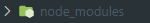
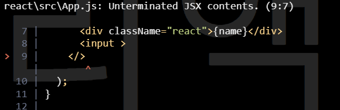

<img src ="data:image/png;base64,iVBORw0KGgoAAAANSUhEUgAAAVsAAACRCAMAAABaFeu5AAABCFBMVEXz30mKU6YuLiz09PP55UqFT6AkJSuRhzp0bDb4+vb14UmATZqGS6N5SZIsLCwfIiq+pctxRInn4OonKCuCTp1vQ4aHTqQdICqESKIqKix8S5bs2ElsQYIYHCrz8fJ3SI/Zy99kOH+UYq3dy0ZDQS+YabChlD1hNIA7Oi7PvkTs5+2NV6iwjsHe0+Pk0Ue9osummT27rEFqYzaEeznDs0KfdLXKtdSdcbOngLpSTjGLgTl5cTc8Oy62mMbGsNFqQHpjXTRZVDLTw9uHZm5eL4F5UnXbxky8pletk2OQcWtxSHjNt1HIsVeghWKAXnK5oF2YfGaIa2sLEymtkGJ6VXV/XnAABCnCq1bAfQ42AAAPoklEQVR4nO2deX/bxhGGEXgDklsGcIWaEEJTtUyKISWL5hVbIuWYsh01Ppo0Z7//NykAXgD2XWAWh1wmeH/+TwAsPhzNLGZnZjWtEte+f/z3f371t398+eUXRepzf67/B3Ht1GP7tce2ULQVW0/8zmP71deV3ZYg9q9vArYFo63YemI/nD6q2JYj9v7UD2UV2+LFtQ+PK7bliGuPS1kmVGw9th/LWYJVbINlQimhrGLrLxPKWYJVbD2f8LacZULFdrdMKNzdVmw1PnpdsS1J7NNpOe62YltaNqFi67H99+mjUkJZxVZjPwZsi04wVmy9UMbL2XSo2PqJ8cclLRMqtvxTWaGsYst+qtiWJfbeD2UV2zLEfgsSjBXb4sXbpS0TKrbDbWK8YhsR3yrHIz6+29QmFI72UNl6PBlj7VHXV1tjLCtg9sN60+HPx5Yhpd7lcdWG49mqN9Bd0zXNm971tDbpcpYBL3tbVjbhM7NlNUOPy16mwOWsPVkOLMdyPazBLabpGo5j9WZzdbzBMmH/VtaEaqVAhDd9draOGZdVT2TL2d1MdwxT+E503QPc64/U6PLRh/Ae79lDqFfJcJ/Cm1628sHJKVazBEJGElvOukvDQmA3eB29Nkp3KqEHfvwmskw4aiA9+DYJ7vEbdM/5089tt2psebtmil4kItO5mSiENfYxEspa3zYeIF0msG19C2951jwotmx4nWCzO9u1Zm2y6fqJ8XA24fgFhNt41ZSb7SW64cnn97cKbDmfmHYqWV/OdZcKV1gmXJxDKzy/kKFtPkPfxslZ64DYcu/idKPdPKM3JLoFb5nwKJK8bb7ChvviWAb3CF3+nX95gaTUpcKW1TpEsp5cfUiyXN59HX/jbV1il/sSu9zmQ3T5UWDmhbJSlQJbNlZA68G9IbkFfvdNvMxOEpoCByqq9fQEXfyseUBs+bBDdQibx1y3CW6B/Vcss5OFs2cIbhNd3HiydiCF81IRmS1v37hKaHXdmlLY/gdU48vCGTJbbORnrQNiy2bihWly+ulegf0Msgk48m/iU8xsnyCz3V5YAjG6qGz5UB2tbrrdNMvdV+OnE9usq6IXwm9hZ+DlQCOKzHaa8jYGZazSDJd3hVAW/KW/RAEKhLMLuP7aOeZyoBFFZMuGWdDq+i+TFMPld+/gpgOMUB61qyjc5nN02eXOdZSFjSQq25mErWkbjmPYOMyZzjTNKbCfJNX40CC3y9b9VTDo7RfCZWEjicaWj3S4/nKdm9VsPF7Ur13wxmYMxqk5m/UyASTGZeHsedhw4WKt8WJ/SVnYSKKxZRMYyZzepL3eqODd2iB2iWvVCZncTW0C2Ic8loWzsFdGV4QTDyVRo4nIdoFcQqem7eBxNlpGXtusmwkhR87bH2R7vK0zHM7e7K0Sr7/CCbPCeamIxJZrPeBQnVoEHmdjZ+cX3A4ty8hH76RldscwT/DgwdXWm7auYCALL9OKRKUsGts2QGtM487Ug7v+ken0hrSNncT989YRhLtbBRzDnM7LA2OLVmCGmERktQCubdc0aoLx14ROB2yX3up1TQ/uUMQykUUgyiwaWxDK3FuRH9dWhme0t3fk3Uh/mSDfP2++QXAbG8OFwe786ReHz9aYoYROV7f0MdVo/S/j9yS2rTO4fG0EHhfGuvjOT148uURiu3OkIVkwD8P6067CFjpvJ/efH8PXrrXHbX4HfhbfscwHJ6dobPtUtppGN1r/2tFpcinYBQ5nvuGiV7JGfKc9M5cilJ1tTaUIQfa/f4KZmr2aV9ApPGnCQNd4E89B5v8V83w6Elvkb+s5Shd3D/41rWIchzNvoYUi2YmwFZz/V8zz6bLGMnMwyg9Xmk3YqfUUhTPPQMEuWeO5kDrP/Rvm+nQktnOwvpU6XLq49uNpWsU43lE/uRCjXONI3E7L+xvmEo1tF7A1iZvkCVovE1Iay1ow+/0QlNJciXvsOX/BfCK+8w5AitHtKdXUAe2n2SWxhQViJ4JLEAPZQbDVtBUqVbIHxKyB9D//idLbL9lRj+v8KSgNyfPb5RY1xwjzt66xaOehu63GT6kYl+yox8z2OSpeyMUmr4j7DnPJLq/VG+egy9+TqvElBWJRHcFbc9LJJyJb6HAD0+1cZ6a7TowTGstkBWJhXcGCpvyAcijvXqRPV7kMf6P9MiGNLa6dCXuEN7g6twBC2UVkK3UKAV1Hn91l6ICiT7OT7KjvdYIC2aGw1W6TippNo7OaaKrG6y0TqNPsUsJZ46GkNrcoTJlErquZi+maiGx116DQtCfZUd/qSNYMURinLKLXMdbTKmtcS1+oJG+Vptm18I76xmzBG9lBse3i8o+wTMtY0l8n1mV2xF5TyY76Gu0TabV+oaxURa9tppWNG3b9jhjV+EhlTM0x2mbYSBLIDoetxmcpLndLd0bzDPyT2tBbWTiTBrJDYqutSDW4pqHXSNX4sjI7LGk4w29kh8XWW+vT4Pq1H3NCKZjiNLsWNlyQET9Ath7cKckt+K8Ts1TT3TWW0dhK02Hypr5DYuu5hRm1WcfqpaTOOVcaets6ky4T5E19h8TWAzImdp3qrj1O9AtBYpzOVlIyGkjS1HdgbINuaYdmumanlrQaUxvMmvRi1riUtlEXD0xBymw1pvVtYvODs0iAq7ZMkJTob+BKe9SLB6Ygdbb+dIq6Q2xHX8if5FeMJ++fh81WUoubFs4K56WiDGx9rztf0eh25BvtQv95gpLeeAPDRfuQh8nWdwyTW4PiGZy5xCsozcaXVNeEJMnWFI1LSRnZeo6Bz6cGHAgUkXsjKb/ZT7MjmC2sCovo8s9jt1owe2241J20BmprKWGrMPQWln/EvALc5j1UtlrQnNPvpTleBw8A8RPjxMGssqaSiGB5wgGz9el6jtdKdLw27vT3x9TQ7DYtkG0MF4az4kBlUE62wfTA4dJOmmNjQcNl3z8mZmqS3sjCcNEuemGcsig3Wy1Y8C4G8pc13BnRph7zgoqYof9FucaCKGVTEWyDAY19KV1zAFJiCqfBAZBXuLZR9ArFQMqoYtgGdGu6xO9aYI1LXiagdpIj3GMiTq74c7ANPIMku2uAN9/4NDuZ0BSlxvNjXE0u7knmB5RDxbH1w1of+gV7JTbvsMTGshBb8EZ2ciHZmRTDWW4+eVQkW8904SwA5HDZ92hMjYhW0o0jWZcJg5jy4smlQtnuOnrjDxSmf/Au8dBY0F8WNJEd43bU+CCmnHTyqWC2XLtGLetCMAv6z9Nn46NxNI0jnx8eSyGEs5x08kl5/m3a/Jkx8AqWMBEITbMDHgGNA9wMUZIY7uWh9fPu5K0FUnpK4WQbaywU+aNpdqLZIn6bujqJ4cbmChbCKE2y8lgltt4bQlqrKXQKgO3Pp+mhDKYWdwkvbLixLYgMpJTF+RjXCzBQnmjgOfmcT3qOq9+leAXQ0iOw3SfGk+A20TjmHTs8PzQyZek+2HI+XP2BDY5NAQp0KWfDlZ+stcFMish1JLZ3hDdeOFctlKeFTf6ewr3o2ZnR5L2OLmzbNNEYNPgn7IhsORvN3LWFWyj1kvxAwJZwzAu0y3BCBheTNy7vj63/p2wFXhQYHO+CF6mOENa5Nh7s0oiJ00H5CKzBrEm8sZ1wGhyeqxYOVbLh2a/uafba9k/ZZxL/hP6PJ6CothNbjnI+j9R7OEJo2ov10Rosvr5dj6lJZIsDWXSJBR1yJJwVwhDLz05ZW/9n6qJXYHWwI2NHwhVnd9NOxBjNjrQaiY9QI5rwXsbSq/FbiNtJtDpJNjz7xT3MuvTcwU3oHdQWhlTDqbaR13/fWYt7Nh3JkCquoVGuQj5hfcxL4jIB/r0LVXWSddh+tErxTLdYuquowVnT6IfkbdTZZN+y0BXjAcoQdODIHw8tytXY0/h1eOht2CJhEjE2oEp2WWiSQilg/YV+zYiTs25DSDyThCjCSzA++QNvkhvmYsQi7yP+xtk1rH0W1nTpp8HhAe1i2dexLJyVOhPbX+iLrs82+6PgFDfOWHvSgxsF4VIYec+eaemzYXv9rPXj5nUbXytsRqb2n2NHCuZ6yOYKbvsky0E7/gUanGkN6v25p369Z+Er9LDjSOjZMw2r5z1r6Mt/nCPZ0nEFN7+bZid1CfCAHFSXJCm52fb3lsN25Mq2Bm2n48mRzFqOZxP4MqHHwX+W4cnuWPLyJdEl8N9PE/d4cSDDXWSyVt/1F1EKWzjTi6RYdRwfofmsChKH5fNRyv45jFCSdmhZWuGoPLv1Inw2Jm4vtrxi8/SKuiSJ78j7ZQKGi9/IZF1keJz7pn2nHLayOdZpcsZCHruvdI5OTCCPwZKb9iSBTN6NgyvxSj1jK9FTyiSYre8e65m+pbVA9iFl/xyf9AbP0ll/F5IxuW9KPBuOt6+JLTVhFCjpoN1mhmuAlCRLHFODA5m8XUT+dlbmmYb8Tlc+XggfAdXOCtcdiDkM3v4tySVcwNgkb3NKDGelsfXCELFdaSu7h6u8eXuVadXh2qCBLxjMKmUrObIhoa9UWqDb+O64PLZePFOC6+qygwi5NlP8mtZo53ASQ8I0O8mRDfIu/vVdksLysxLZ+osFultwDeBst0B431B1MLaO0CZPs8NHNuCC+xBbSTh7Uh5Z/4PMZdWFIloz6WAhTm+I3Mi6xh29/tBbGVvY/thIOps34SvxVBbWzSfp3tKQGKnNze0FtSHS/6acpaRDB54GtxHeApOOo9kbrqRuvwyiYSRajYDEdaapU0E9051atGWd6/RkZ0vvp9mJiGB5orQxL2K4OJwVj1NAUu8kI6Ees835cIpPmY+RvelLj3xJmI2PT4QDJctA2OILBSlDsnLk7R62j4I4Hcl71MJMxGsaTuIAzKAaHy8TcCBLGEcTvhc2qhdFMBEJu6sNHMeOMzFdo2OojaTjrD1Z6o7HVwRsGh1rMBsmPs7vP8d7vClnP6bBRV9MAehISPiwvxrYHccybNv/ZzkdS+8tJ7G9GcKjONOG4/qNbqwf5it4mtmrj4c85XHrZQIKZRfnaRUJSfJWxuLtuZApIfFMbjgfL5ZTX/VZfzLsppGQPss/D244GS9mwcOmy8X2aaknm8r2z5uvzo9EUQLZWscPxfuzcMqqYGdrpwyzP6PPyvA0rkkT460mEhUtvD/HxztA8fYppWK8IH3uT3u/CqbZ0SeuVWwVxH5QGQFUsVXRetOBPs2uYkuX4jS7iq2C2Gva/PaKrbK21fhpDZEVW3XRGssqtlm0rcanDhSu2NKVfGhsxTaPNv3n92S2fym2nL1+dI/LhL8W2zvyUSQVW0WxT+82CcbKbouWt0xYrxIquy1c7G1gtvcVyr74H/Fg9jj45k4FAAAAAElFTkSuQmCC" width=900>

# JSX

## 코드 이해하기

#### hello-react 프로젝트를 보면서 설명합니다

### src 폴더에 App.js 를 보면 `import React from 'react'` 라는 것이 있는데 이것은 리액트를 불러와서 사용할수 있게 해 주는 것이다

### 프로젝트를 만들면



### 이런것이 나오는데 이안에 react 모듈이 설치 되고 여기있는것을 불러와서 사용할수 있는것이다

```js
function App() {
  return (
    <div className="App">
      <header className="App-header">
        
        <p>
          Edit <code>src/App.js</code> and save to reload.
        </p>
        <a
          className="App-link"
          href="https://reactjs.org"
          target="_blank"
          rel="noopener noreferrer"
        >
          Learn React
        </a>
      </header>
    </div>
  );
}
```

### 이건 App.js 코드의 일부분인데 이 코드는 App 이라는 컴포넌트를 만드는 것이다

### 여기서 return 을 보면 HTML 과 비슷하지만 JSX 라는 것이다

# JSX란

### JSX는 자바스크립트 확장문법이다

### JSX 로 작성된 코드는 코드가 번들링 되는 과정에서 바벨을 사용하여 일반 자바스크립트 코드로 변환된다

##### \* 번들링 : 여러가지 파일을 묶듯이 연결하는것

##### \* 바벨 : 최신 ES6, ES7 버전의 javascript코드를, ES5버전의 코드로 바꾸어주는 Node.js 패키지 (구버전 웹브라우저와 호환하기위해 바꾸어줌)

### 변화되는 과정을 보면

```js
functuin App(){
    return(
        <div>
        Hello <b>React</b>
        </div>
    )
}
```

### 이러한 코드가 있을때

```js
function App(){
    return React.createElement("div",null,"Hello",React.createElement("b",null,"react));
}
```

### 이런식으러 변경되게 된다

### 만약 JSX를 사용하지 않으면 저렇게 createElement를 해야한다 그렇게된다면 엄청나게 불편하기때문에 JSX 를 사용한다

## JSX 의 장점

## \* 보기 쉽고 익숙하다

### HTML과 비슷하여 가독성이 높고 작성하기 쉽다

## \* 활용도가 높다

### JSX에서는 HTML 태그를 사용할수 있고 자신이 만든 컴포넌트를 HTML쓰듯이 쉽게 사용할수 있다

# JSX 문법

### JSX 에도 몇가지 규칙이 있다

## 감싸인 요소

### 컴포넌트에 요소가 여러개 있다면 반드시 부모요소 한개로 감싸야 한다

```js
import React from "react";

function App(){
    return(
        <h1>React</h1>
        <h1>React</h1>
    )
}
```

### 만약에 이런 형태로 코드를 작성했다면 제대로 작동하지 않을 것이다

### 왜냐하면 여러개의 요소가 부모요소로 감싸져 있지 않기 때문이다

```js
import React from "react";

function App() {
  return (
    <div>
      <h1>React</h1>
      <h1>React</h1>
    </div>
  );
}
```

### or

```js
import React from "react";

function App() {
  return (
    <>
      <h1>React</h1>
      <h1>React</h1>
    </>
  );
}
```

### 이런식으로 감싸주면 제대로 작동된다

<br>

```js
function App() {
  return <div>Reacy</div>;
}
```

### 만약 요소가 여러개가 아닌 한개라면

### 부모요소를 감싸지 않아도 작동 된다

## 왜 부모 요소로 감싸 주어야 할까

### Vitural DOM에서는 컴포넌트 변화를 효율적으로 감지하기 위해서 컴포넌트는 하나의 DOM 트리 구조로 이루어 져야 한다는 규칙이 있기 때문이다

## 자바스크립트 표현

### JSX 에서 코드를 {}으로 감싸는것 으로 자바스크립트 표현식을 사용할수 있다

### Ex)

```js
function App() {
  const name = "리액트";
  return (
    <>
      <h1>재미있는 {name}</h1>
    </>
  );
}
```

### 이런식으로 작성하면


### 이렇게 나온다

## if 문 대신 조건부 연산자

### JSX 내부에서는 if문을 사용 할 수 없다

### if문 대신 조건부 연산자를 사용한다

### Ex)

```js
function App() {
  const name = "리액트";
  return <>{name === "리액트" ? <h1>리액트 O</h1> : <h1>리액트 X </h1>}</>;
}
```

### 이렇게 작성하면 name이 리액트일때는 리액트 O 가나오고 name 리액트가 아니면 리액트 X 가 나오게 된다

## AND 연산자 (&&)를 사용한 조건부 렌더링

### AND 연산자는 조건에 맞으면 ture 아니면 false 인데 리액트에서는 false를 렌더링할때는 null 처럼 아무것도 나타나지 않게한다

### 이를 이용해 조건에 맞지 않으면 아무것도 나타나지 않게 할때 사용

### Ex)

```JS
function App() {
  const name = "리액트";
  return (
    <>
      {name === "리액트"&&(<h1>리액트 </h1>)}

    </>
  );
}
```

### 이렇게 적으면 name 이 리액트일떄는 화면에 리액트 라고 나오고

### name이 리액트가 아니면 아무글자도 나오지 않는다

## undefined를 렌더링 하지 않기

### 리액트에서는 undefined를 렌더링하면 안된다

```js
function App() {
  const name = undefined;
  return name;
}
```

### 이렇게 작성하면

```
App(...): Nothing was returned from render. This usually means a return statement is missing. Or, to render nothing, return null.
```

### 이러한 오류가 발생한다

## 인라인 스타일링

### 리액트에서 DOM 요소에 스타일을 적용할때는 문자열 형태로 넣는것이 아니라 객체형태로 넣어주어야 한다

### 스타일이름중 background-color 처럼 - 가 포함된 이름이 있으면 - 를 제거하고 카멜 표기법으로 작성해야한다 (backgroundColor)

### Ex)

```js
function App() {
  const name = "리액트";
  const style = {
    backgroundColor: "black",
    color: "aqua",
    fontSize: "50px",
    padding: 16,
  };
  return <div style={style}>{name}</div>;
}
```

### 이런식으로

### font-size 를 fontSize

### background-color 를 backgroundColor 로 카멜표기법으로 변경한다

## class 대신 className

### JSX에서는 class 대신 className으로 class를 설정해줘야한다

### Ex

### App.js

```js
import React from "react"; //리액트를 불러와서 사용할수 있게 해 주는 것
import "./App.css";
function App() {
  const name = "리액트";
  return <div className="react">{name}</div>;
}

export default App;
```

### App.css

```css
.react {
  background-color: black;
  color: white;
  width: 1000px;
  height: 500px;
  font-size: 300px;
}
```

### 이렇게 작성하면


### 이렇게 나온다

## 꼭 닫아야 하는 태그

### HTML에서는 `<input>`태그를 `<input></input>` 이라고 입력하지 않고 `<input>` 만 입력해도 작동 하지만 JSX는 닫지 않으면 오류가 생긴다

### Ex

```js
import React from "react";
import "./App.css";
function App() {
  const name = "리액트";
  return(
  <>
    <div className="react">{name}</div>
    <input>
  </>;
  )
}

export default App;
```

### 이렇게 input 태그의 괄호를 안닫아 주면



### 이러한 오류가 생긴다

### 오류를 고치기위해

```js
import React from "react";
import "./App.css";
function App() {
  const name = "리액트";
  return (
    <>
      <div className="react">{name}</div>
      <input></input>
    </>
  );
}

export default App;
```

### 그냥 input 태그를 닫아주거나

```js
import React from "react";
import "./App.css";
function App() {
  const name = "리액트";
  return (
    <>
      <div className="react">{name}</div>
      <input />
    </>
  );
}

export default App;
```

### `self-closing` 이라는 것을 통해 선언하면서 동시에 닫아 줄수도 있다

## 주석

### jsx 에서 주석은 `{/* ... /*}` 이렇게 사용한다
