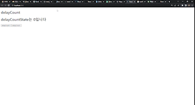

# Recoil

## Recoil 이란?

Recoil은 React 프로젝트를 위한 많은 전역 상태관리 라이브러리들 중 하나다  
다른 라이브러리(Redux, Mobx)와는 달리 React 전용이며 React에 최적화되어 되어있다

## Recoil 설치 적용법

설치

```
yarn add recoil
npm i recoil
```

적용법

```js
const root = ReactDOM.createRoot(document.getElementById("root"));
root.render(
  <React.StrictMode>
    <RecoilRoot>
      <App />
    </RecoilRoot>
  </React.StrictMode>
);
```

App.js의 <App/>컴포넌트를 <RecoilRoot>로 감싸주면된다

## 주요개념

# atoms


`atom` 을 쉽게 이해한다면 비눗방울로 추상화 할 수 있다  
 우리가 만드는 Web Application 을 구조화 한다면 그 구조의 상단에 atom 이 비눗방울 처럼 둥둥 떠다니고 있다고 추상화 할 수 있고 만약 개발을 하다가 어떤 비눗방울 (상태) 이 필요하다면 해당하는 비눗방울만 쏙 빼서 쉽게 사용할 수 있다

`atom`은 우리가 전역으로 사용할 상태를 담는다

```js
import { atom } from "recoil";

const count = atom({
  key: "counting",
  default: 0,
});

export { count };
```

이런식으로 atom을 만들고 atom안에는 atom을 구별할 key와 기본값인 default 를 넣어야 한다

```js
import { useRecoilState } from "recoil";
import { counting } from "./stores/a";
function App() {
  const [count, setCount] = useRecoilState(counting);
  return (
    <>
      <h1>{count}</h1>
      <button onClick={() => setCount((prev) => prev + 1)}>+1</button>
    </>
  );
}

export default App;
```

useRecoilState 라는 간단한 hook 을 통해서 atom 을 가져와서 값을 추적하고, 값을 변경할 수 있다

```js
const setCount = useSetRecoilState(counting); //useSetRecoilState : 전역상태의 setter 함수만을 활용하기 위해 사용
const count = useRecoilValue(counting); //useRecoilValue :전역상태의 state 상태값만을 참조하기 위해 사용
```

이런식으로 따로따로 분리해서 사용할 수도 있다

# selector

Selector는 atom 혹은 다른 Selector 상태를 입력받아 동적인 데이터를 반환하는 순수함수다

## get

Selector를 설정할 때도, Recoil의 selector() 메서드를 통해 등록하면 된다. 기본적으론, key와 get 2개의 프로퍼티를 설정한다.

key : 고유한 key 값  
get : Selector 순수함수. 사용할 값을 반환하며, 매개변수인 콜백객체 내 get() 메서드로 다른 atom 혹은 selector를 참조한다

```js
export const countTitleState = selector({
  key: "countTitleState",
  get: ({ get }) => {
    return `현재 카운트는 ${get(countState)} input값은 ${get(inputState)}`;
  },
});
```

이런식으로 사용한다

## set

set 함수(프로퍼티) : 쓰기 가능한 Selector

Selector에 set을 설정하게 되면, 쓰기 가능한 모드로 변경된다. set은 콜백객체, 새로운 값 2가지를 각각 매개변수로 받는다

set은 여러개의 atom 정보를 동시에 수정할수 있다

set 메서드를 쓸 때 유의할 점은 본인 스스로를 수정할 수 없다

```js
export const countTitleState = selector({
  key: "countTitleState",
  get: ({ get }) => {
    return `현재 카운트는 ${get(countState)} input값은 ${get(inputState)}`;
  },
  set: ({ set }, newValue) => {
    set(countState, Number(newValue));
    set(inputState, newValue + "");
  },
});
```

이런식으로 사용한다

# 비동기 호출

## Suspense

recoil 은 비동기 상태에 대한 처리를 React의 Suspense 를 통해 지원하고 있다  
그러므로 비동기통신을 사용하는 selector 를 사용할때 해당 컴포넌트를 Suspense 로 비동기 상태에 대한 처리를 할 수 있다

```js
<React.Suspense fallback={<div>로딩중</div>}>
  <RecoilStar />
</React.Suspense>
```

## useRecoilValueLoadable, useRecoilStateLoadable

Recoil에서는 useRecoilValueLoadable, useRecoilStateLoadable라는 것을 제공한다  
useRecoilValueLoadable, useRecoilStateLoadable 이 둘의 차이는 setter가 있고 없고 차이다

이 함수를 호출하면 2개의 값을 반환한다

- state : 비동기 상태를 나타내며 hasValue(값이 존재하는 상태), loading(로딩중), hasError(에러발생) 3가지 상태가 존재
- contents : 비동기 통신의 결과 값

```js
const RecoilStar = () => {
  const recoilStar = useRecoilValueLoadable(recoilStartCountState);
  if (recoilStar.state === "loading") return <div>로딩중</div>;
  return (
    <>
      <h1>recoil git hub star</h1>
      <h1>{recoilStar.contents}</h1>
    </>
  );
};

export default RecoilStar;
```

# 캐싱지원

select를 통해 비동기통신시 가장 큰 장점중 하나로 자체적으로 캐싱을 지원하기 때문에 같은 입력값에 있어서 이전에 캐싱된 결과를 바로 보여주기 때문에 퍼포먼스 면에서도 훨씬 유리한 장점이 존재한다

위처럼 이전의 값으로 변경하면 캐싱정보를 통해 바로 로딩 없이 호출되는것을 볼 수 있다
